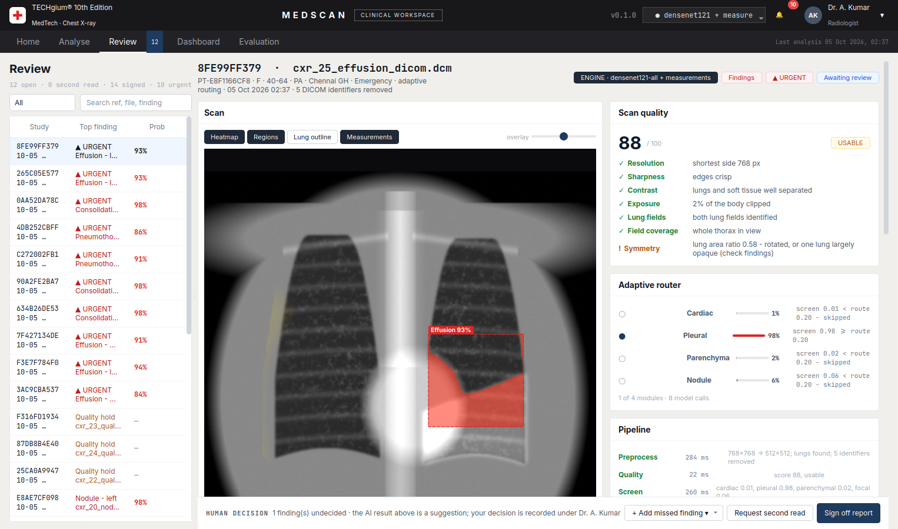
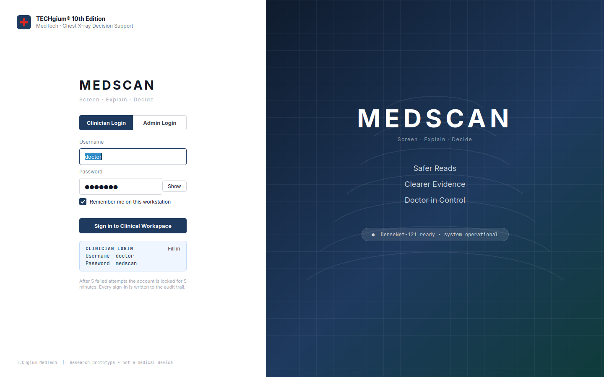
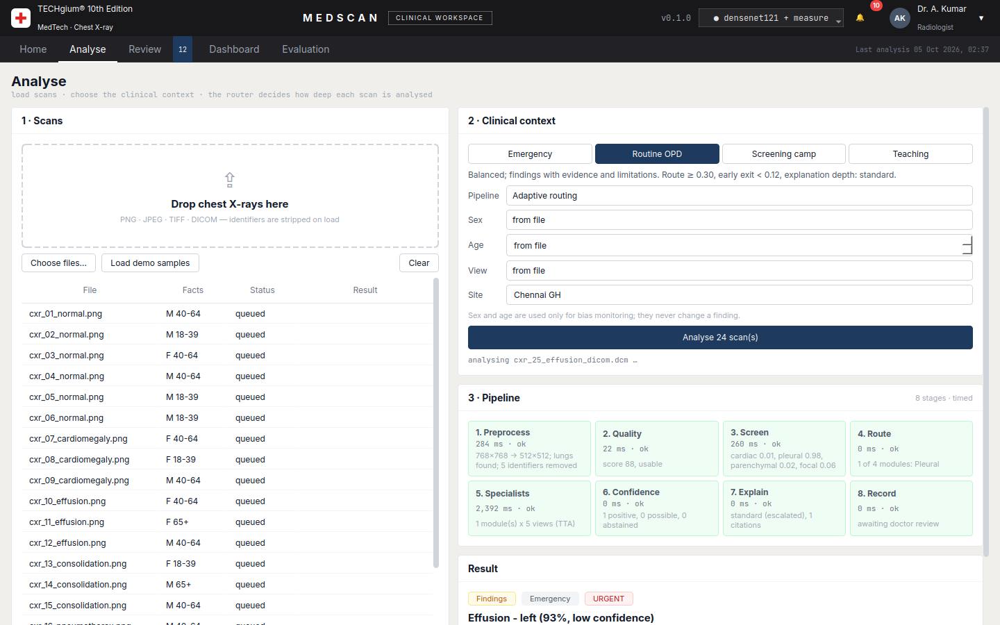
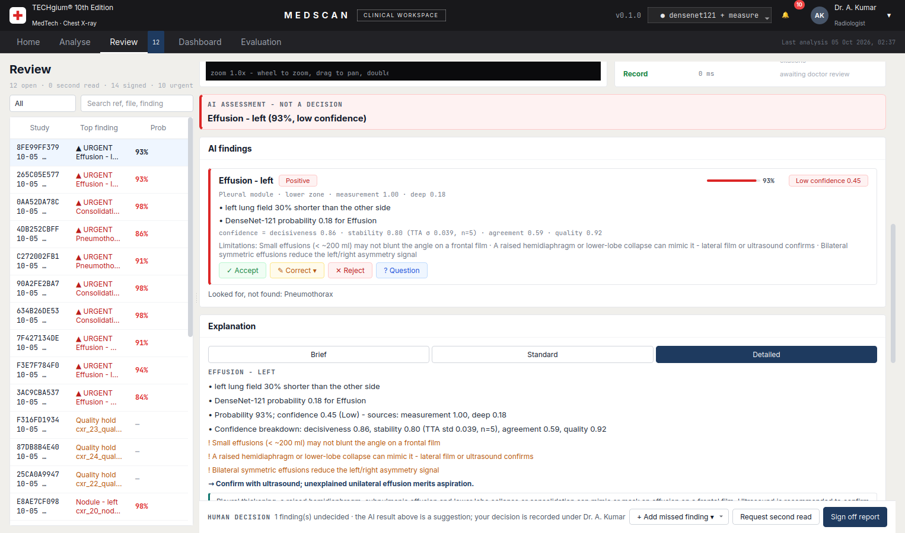
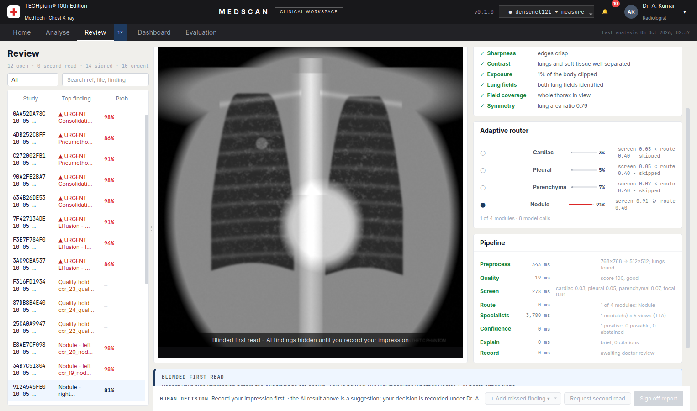
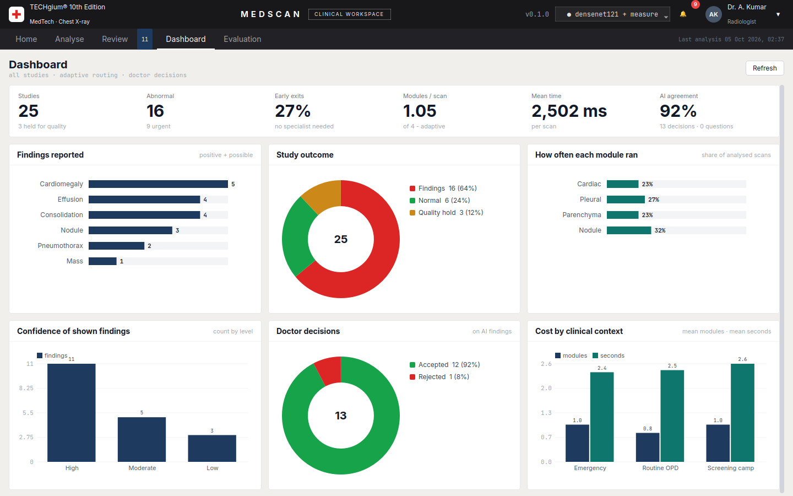
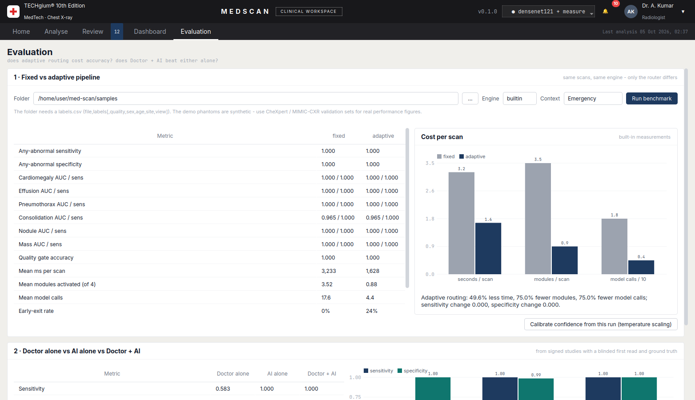
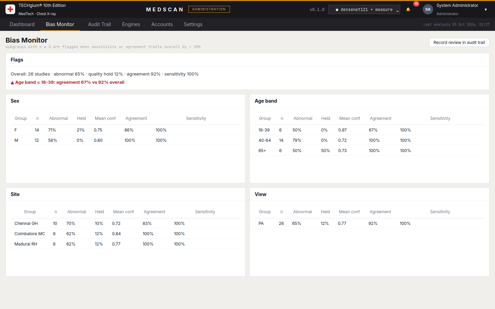
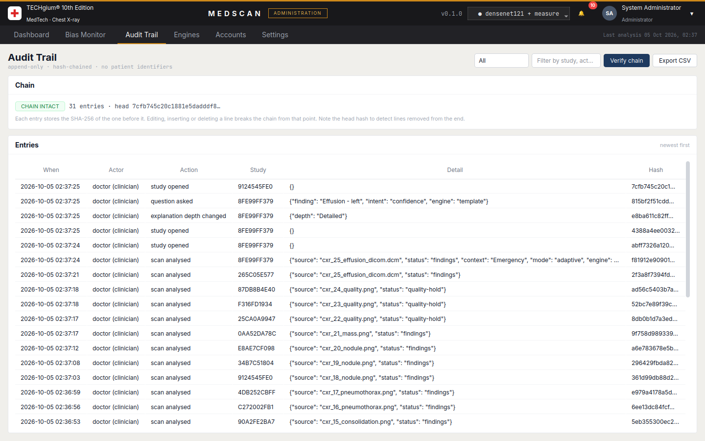

# MEDSCAN: chest X-ray decision support with adaptive analysis routing

**TECHgium® 10th Edition · MedTech challenge.** This is a desktop prototype of a
human-in-the-loop AI system that helps doctors read chest X-rays.

The brief asks for a system that:
* highlights abnormalities and adapts its explanation to the clinical situation;
* gives a confidence score and limitations for every finding;
* refuses poor scans instead of guessing;
* lets the doctor question, correct or reject each finding;
* measures whether Doctor + AI beats either alone;
* protects privacy, monitors bias and keeps every decision traceable.

MEDSCAN does all of this in one PyQt6 application. It is built on the same
architecture and visual language as SENTRA.



## Quick start

```bash
pip install -r requirements.txt     # or requirements-app.txt for the slim, offline build
python tools/make_phantoms.py       # (already committed) regenerate the demo samples
python medscan.py                   # sign in: doctor / medscan   or   admin / techgium
```

* `python medscan.py --present` enlarges everything 1.5×, for projectors.
* `python medscan.py --screenshots docs` renders every screen without a display.
* `MEDSCAN_SMOKE=1 python medscan.py` builds every page with demo data, then exits.
* `python -m msx.evaluation samples` benchmarks fixed vs adaptive routing.
* `python -m pytest tests` runs 32 tests.

On **Analyse**:
1. Press **Load demo samples**, then **Analyse**. The samples are 25 synthetic
   phantoms with known ground truth, plus one DICOM with a fake patient header.
2. Double-click any row to open it in **Review**.

## What it does

| Brief requirement | Where in MEDSCAN |
|---|---|
| Identify and highlight abnormalities | 4 specialist modules (Cardiac, Pleural, Parenchyma, Nodule) plus a DenseNet-121. The viewer shows the heatmap, finding regions, lung outline and CTR measurement lines |
| Adapt explanation to the clinical situation | Context (Emergency / Routine OPD / Screening camp / Teaching) sets the router thresholds and the explanation depth. Depth **escalates automatically** when the AI is unsure |
| Confidence and limitations for every finding | Probability, plus a confidence built from decisiveness, test-time-augmentation stability, model–measurement agreement and scan quality, plus finding-specific limitations and mimics |
| Detect poor scans, request human review | 7-check quality gate. Any fail stops the pipeline with **no findings**, marked *Quality hold – human review* |
| Doctor can question, correct, reject | Accept / Correct ▾ / Reject / Question on every finding; *Add missed finding*; Q&A answered from the evidence and cited guidelines; sign-off or second read |
| Evaluate Doctor + AI vs either alone | **Blinded first read** before the AI is revealed. The Evaluation page compares Doctor alone, AI alone and Doctor + AI (sensitivity, specificity, read time) |
| Privacy | DICOM identifiers stripped on load; HMAC pseudonyms; only de-identified images are stored; no identifiers in the audit trail |
| Bias monitoring | Bias Monitor slices by sex, age band, site and view, and flags gaps over 10 points |
| Decision traceability | SHA-256 hash-chained audit trail of every analysis, decision, question and sign-in, with **Verify chain** |

The analyser engine is documented in [`docs/ENGINE.md`](docs/ENGINE.md): what
each stage does, how and why.

### The adaptive router, in one picture

```
Quality ✓ → Screen (4 group scores) → Router ─┬─ all low ─▶ early exit (0 modules)
                                              └─ per group ≥ threshold ─▶ only those specialists
```

On the phantom benchmark adaptive routing used **50 % less time, 75 % fewer
modules and 75 % fewer model calls than the fixed pipeline, with no loss of
sensitivity or specificity** (synthetic data; see the caveat in ENGINE.md).

## Workspaces

One sign-in; the account decides the workspace.

* **Clinical** (doctor / medscan): Home, Analyse, Review, Dashboard, Evaluation.
* **Administration** (admin / techgium): Dashboard, Bias Monitor, Audit Trail,
  Engines, Accounts, Settings.

| | |
|---|---|
|  |  |
|  |  |
|  |  |
|  |  |

## Tech stack

| Layer | Technology |
|---|---|
| Desktop UI | **PyQt6** with the SENTRA design language (Inter + JetBrains Mono, navy #1E3A5F on #F0EFEB). Charts are drawn with QPainter |
| Imaging | NumPy, SciPy (ndimage), OpenCV, Pillow, **pydicom** |
| Deep model (optional) | **PyTorch + TorchXRayVision** DenseNet-121 (`densenet121-res224-all`), with Grad-CAM |
| Built-in analyser | Classical lung segmentation and interpretable measurements (CTR, costophrenic angles, zone density, lucency, LoG blobs) |
| Uncertainty | Test-time augmentation, temperature scaling, abstention |
| Medical RAG | BM25 over curated, cited guideline passages (`msx/knowledge/kb.json`) |
| LLM narrator (optional) | Local **Ollama** (e.g. `gemma2`), fact-checked against the findings |
| Storage | **SQLite** (studies, decisions, questions), PNG images, hash-chained JSONL audit |
| Security | PBKDF2-SHA256 passwords, account lockout, role-based workspaces |
| Packaging | PyInstaller spec (`packaging/medscan.spec`) |

## Layout

```
medscan.py            desktop entry point (sign-in, --present, --screenshots, smoke test)
msx/                  the analyser engine
  imaging.py          load + de-identify + normalise
  anatomy.py          lung segmentation, CTR, costophrenic angles, zones
  quality.py          7-check quality gate
  screening.py        built-in screen + DenseNet-121 (+ Grad-CAM)
  router.py           adaptive analysis router
  specialists.py      Cardiac / Pleural / Parenchyma / Nodule modules, fusion, TTA
  measures.py         zone opacity, pneumothorax lucency, LoG blob search
  uncertainty.py      confidence, abstention, temperature scaling
  explain.py          adaptive explanation, Q&A, guarded LLM narrator
  knowledge.py        BM25 retrieval over knowledge/kb.json
  pipeline.py         the 8-stage AnalysisEngine
  datastore.py        SQLite store: studies, decisions, first/final reads
  audit.py            hash-chained audit trail
  evaluation.py       fixed vs adaptive benchmark; Doctor vs AI vs Doctor + AI
  bias.py             subgroup monitoring
  accounts.py         clinician / admin accounts
ui/                   PyQt6 interface (theme, components, login, window, pages/)
samples/              synthetic phantoms + labels.csv + one DICOM
tools/make_phantoms.py
tests/                pytest suite (engine, store, app offscreen)
docs/                 ENGINE.md and screenshots
```

---

*Research prototype for TECHgium. Not a medical device and not for clinical use.
The demo images are synthetic; demo reviews are simulated.*
